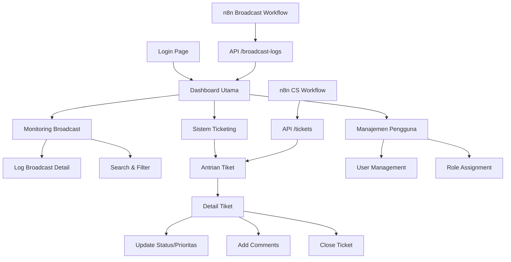

# Product Requirements Document (PRD)
## Dashboard Monitoring Broadcast & Ticketing Logistik Terintegrasi n8n

## 1. Product Overview

Dashboard operasional terpusat yang dirancang untuk bekerja secara langsung dengan workflow n8n, memberikan visibilitas penuh terhadap alur "Broadcast Logistik" dan menyediakan sistem "Ticketing Customer Service" yang fungsional dan otomatis.

- Aplikasi ini menggantikan monitoring manual log n8n dengan dashboard web yang real-time dan user-friendly untuk Tim Logistik dan Customer Service.
- Target utama adalah meningkatkan efisiensi operasional dengan otomatisasi penuh dari broadcast WhatsApp hingga penanganan tiket customer service.

## 2. Core Features

### 2.1 User Roles

| Role | Registration Method | Core Permissions |
|------|---------------------|------------------|
| Admin | Dibuat oleh sistem/admin lain | Dapat melihat semua tiket, mengelola broadcast monitoring, manajemen pengguna, akses penuh dashboard |
| Agent (Agen CS) | Dibuat oleh Admin | Dapat melihat dan mengelola tiket yang ditugaskan, akses terbatas pada dashboard |

### 2.2 Feature Module

Aplikasi terdiri dari halaman-halaman utama berikut:

1. **Dashboard Utama**: widget ringkasan real-time, feed aktivitas, daftar tiket prioritas tinggi
2. **Halaman Monitoring Broadcast**: log broadcast terperinci, pencarian dan filter, status tracking
3. **Halaman Sistem Ticketing**: antrian tiket, detail tiket, manajemen status dan prioritas
4. **Halaman Manajemen Pengguna**: CRUD pengguna, assignment tiket, role management
5. **Halaman Login/Authentication**: sistem login dengan JWT, role-based access

### 2.3 Page Details

| Page Name | Module Name | Feature description |
|-----------|-------------|---------------------|
| Dashboard Utama | Widget Ringkasan | Menampilkan total broadcast terkirim hari ini, broadcast gagal, tiket terbuka, tiket ditutup hari ini dalam format card yang menarik |
| Dashboard Utama | Feed Aktivitas Real-time | Menampilkan log broadcast terbaru dan aktivitas tiket secara real-time dengan auto-refresh |
| Dashboard Utama | Tiket Prioritas Tinggi | Menampilkan daftar tiket dengan prioritas high/urgent yang belum ditangani |
| Monitoring Broadcast | Log Broadcast Terperinci | Menampilkan tabel log dengan kolom: Waktu, Nomor Resi, No. Telepon, Status, Isi Pesan, Error Message |
| Monitoring Broadcast | Pencarian dan Filter | Fitur search berdasarkan nomor resi atau no. telepon, filter berdasarkan status dan tanggal |
| Sistem Ticketing | Antrian Tiket | Menampilkan daftar semua tiket dengan status, prioritas, assigned agent, dan waktu dibuat |
| Sistem Ticketing | Detail Tiket | Menampilkan informasi lengkap tiket: deskripsi, data pelanggan, riwayat AWB, timeline aktivitas |
| Sistem Ticketing | Manajemen Status | Mengubah status tiket (Open, Pending, On-Hold, Closed) dengan dropdown dan konfirmasi |
| Sistem Ticketing | Manajemen Prioritas | Mengubah prioritas tiket (Low, Medium, High, Urgent) dengan color coding |
| Sistem Ticketing | Assignment Tiket | Menugaskan tiket ke agen CS tertentu dengan dropdown selection |
| Sistem Ticketing | Sistem Komentar | Menambahkan catatan internal atau balasan untuk pelanggan dengan rich text editor |
| Manajemen Pengguna | CRUD Pengguna | Membuat, mengedit, menonaktifkan akun agen CS dengan form validation |
| Manajemen Pengguna | Role Management | Mengatur peran pengguna dan permissions dengan checkbox interface |
| Login/Authentication | Sistem Login | Login dengan email dan password, JWT token generation, remember me option |

## 3. Core Process

**Admin Flow:**
Admin login → Dashboard utama (melihat semua widget dan aktivitas) → Dapat mengakses semua modul → Monitoring broadcast untuk investigasi → Manajemen tiket global → Assignment tiket ke agen → Manajemen pengguna dan role

**Agent Flow:**
Agent login → Dashboard dengan view terbatas → Melihat antrian tiket yang ditugaskan → Membuka detail tiket → Mengubah status dan prioritas → Menambahkan komentar internal/eksternal → Menutup tiket setelah selesai

**n8n Integration Flow:**
n8n Broadcast Workflow → HTTP Request ke API /broadcast-logs → Data tersimpan di database → Real-time update di dashboard
n8n CS Workflow → HTTP Request ke API /tickets → Tiket baru dibuat otomatis → Notifikasi ke agen yang tersedia

## 4. User Interface Design

### 4.1 Design Style

- **Primary Colors**: Blue (#3B82F6) untuk elemen utama, Green (#10B981) untuk status success
- **Secondary Colors**: Gray (#6B7280) untuk teks sekunder, Red (#EF4444) untuk error/urgent
- **Button Style**: Rounded corners (8px), subtle shadows, hover effects dengan transition smooth
- **Font**: Inter untuk readability, ukuran 14px untuk body text, 16px untuk headers
- **Layout Style**: Card-based design dengan clean spacing, top navigation dengan sidebar untuk desktop
- **Icons**: Lucide React icons dengan style minimalis dan konsisten

### 4.2 Page Design Overview

| Page Name | Module Name | UI Elements |
|-----------|-------------|-------------|
| Dashboard Utama | Widget Ringkasan | 4 kartu statistik dengan gradien background, icon berwarna, angka besar dengan trend indicator |
| Dashboard Utama | Feed Aktivitas | Timeline vertical dengan avatar, timestamp, dan status badge berwarna |
| Monitoring Broadcast | Tabel Log | Data table dengan sorting, pagination, status badge (green/red/yellow), search bar dengan icon |
| Sistem Ticketing | Antrian Tiket | Kanban-style board atau list view dengan priority color coding, assigned agent avatar |
| Sistem Ticketing | Detail Tiket | Split layout: info panel kiri, activity timeline kanan, floating action buttons |
| Manajemen Pengguna | User Management | Form dengan validation states, toggle switches untuk active/inactive, role badges |

### 4.3 Responsiveness

Aplikasi dirancang desktop-first dengan adaptasi mobile yang optimal. Pada mobile, sidebar berubah menjadi bottom navigation, tabel menjadi card layout, dan form menggunakan full-width input dengan touch-friendly button sizing (minimum 44px height).