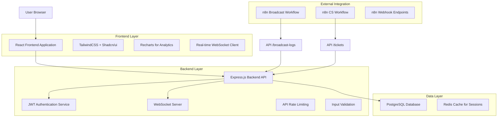
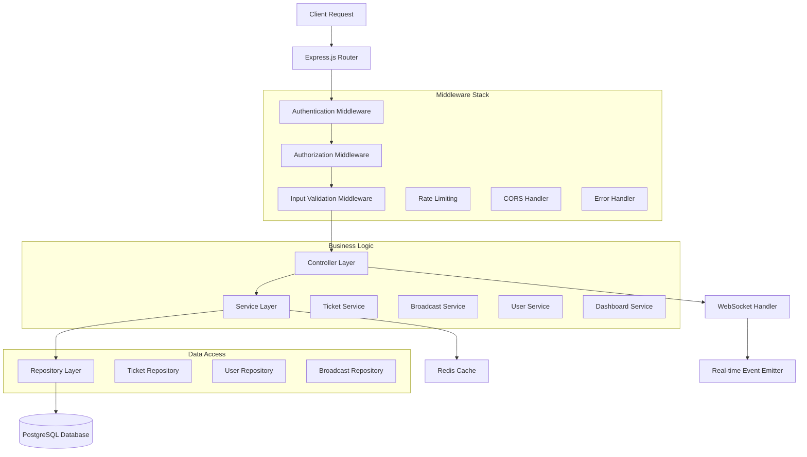
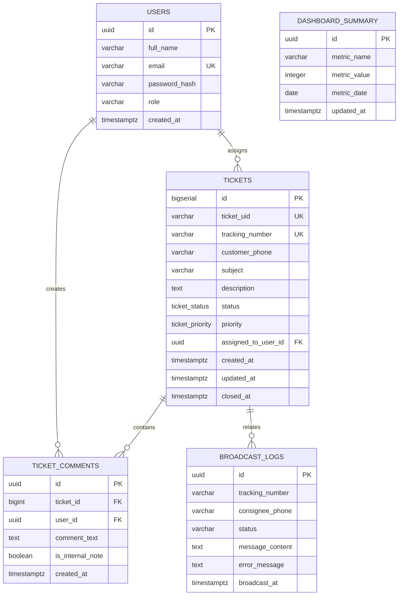

# Technical Architecture Document
## Dashboard Monitoring Broadcast & Ticketing Logistik Terintegrasi n8n

## 1. Architecture Design



## 2. Technology Description

- **Frontend**: React@18 + TailwindCSS@3 + Vite + Shadcn/ui + Recharts + Socket.io-client
- **Backend**: Node.js + Express@4 + Socket.io + bcrypt + jsonwebtoken
- **Database**: PostgreSQL@15 dengan skema yang telah didefinisikan
- **Cache**: Redis untuk session management dan real-time data
- **Authentication**: JWT dengan refresh token mechanism

## 3. Route Definitions

| Route | Purpose |
|-------|---------|
| / | Redirect ke /dashboard atau /login berdasarkan authentication status |
| /login | Halaman login dengan form email/password dan JWT token handling |
| /dashboard | Dashboard utama dengan widget ringkasan dan feed aktivitas real-time |
| /monitoring | Halaman monitoring broadcast dengan tabel log dan fitur pencarian |
| /tickets | Halaman sistem ticketing dengan antrian tiket dan filter |
| /tickets/:id | Detail tiket dengan timeline aktivitas dan form komentar |
| /users | Halaman manajemen pengguna (Admin only) dengan CRUD operations |
| /profile | Halaman profil pengguna untuk edit informasi personal |

## 4. API Definitions

### 4.1 Core API

**Authentication APIs**
```
POST /api/v1/auth/login
```

Request:
| Param Name | Param Type | isRequired | Description |
|------------|------------|------------|-------------|
| email | string | true | Email address pengguna |
| password | string | true | Password dalam plain text |

Response:
| Param Name | Param Type | Description |
|------------|------------|-------------|
| token | string | JWT access token |
| refreshToken | string | JWT refresh token |
| user | object | User information (id, name, role) |

Example:
```json
{
  "email": "admin@company.com",
  "password": "securepassword123"
}
```

**n8n Integration APIs**
```
POST /api/v1/broadcast-logs
```

Request:
| Param Name | Param Type | isRequired | Description |
|------------|------------|------------|-------------|
| tracking_number | string | true | Nomor resi/AWB |
| consignee_phone | string | true | Nomor telepon penerima |
| status | string | true | Status broadcast (success/failed/pending) |
| message_content | string | false | Isi pesan yang dikirim |
| error_message | string | false | Pesan error jika gagal |

```
POST /api/v1/tickets
```

Request:
| Param Name | Param Type | isRequired | Description |
|------------|------------|------------|-------------|
| tracking_number | string | true | Nomor resi terkait |
| customer_phone | string | true | Nomor telepon customer |
| subject | string | true | Subjek tiket |
| description | string | true | Deskripsi masalah |
| priority | string | false | Prioritas tiket (default: medium) |

**Frontend APIs**
```
GET /api/v1/tickets
```

Query Parameters:
| Param Name | Param Type | Description |
|------------|------------|-------------|
| status | string | Filter berdasarkan status tiket |
| assigned_to | string | Filter berdasarkan assigned user (me untuk current user) |
| priority | string | Filter berdasarkan prioritas |
| page | number | Nomor halaman untuk pagination |
| limit | number | Jumlah data per halaman |

```
PUT /api/v1/tickets/:id
```

Request:
| Param Name | Param Type | isRequired | Description |
|------------|------------|------------|-------------|
| status | string | false | Update status tiket |
| priority | string | false | Update prioritas tiket |
| assigned_to_user_id | string | false | Assign tiket ke user (Admin only) |

```
POST /api/v1/tickets/:id/comments
```

Request:
| Param Name | Param Type | isRequired | Description |
|------------|------------|------------|-------------|
| comment_text | string | true | Isi komentar |
| is_internal_note | boolean | false | Apakah catatan internal (default: true) |

## 5. Server Architecture Diagram



## 6. Data Model

### 6.1 Data Model Definition



### 6.2 Data Definition Language

**Users Table**
```sql
-- Create extension for UUID generation
CREATE EXTENSION IF NOT EXISTS "uuid-ossp";

-- Users table for authentication and role management
CREATE TABLE IF NOT EXISTS users (
    id UUID PRIMARY KEY DEFAULT uuid_generate_v4(),
    full_name VARCHAR(100) NOT NULL,
    email VARCHAR(100) UNIQUE NOT NULL,
    password_hash VARCHAR(255) NOT NULL,
    role VARCHAR(20) NOT NULL CHECK (role IN ('agent', 'admin')),
    is_active BOOLEAN DEFAULT TRUE,
    created_at TIMESTAMPTZ DEFAULT CURRENT_TIMESTAMP,
    updated_at TIMESTAMPTZ DEFAULT CURRENT_TIMESTAMP
);

-- Create indexes for users table
CREATE INDEX IF NOT EXISTS idx_users_email ON users(email);
CREATE INDEX IF NOT EXISTS idx_users_role ON users(role);
```

**Tickets Table with ENUM Types**
```sql
-- Create ENUM types for ticket status and priority
DO $$
BEGIN
    IF NOT EXISTS (SELECT 1 FROM pg_type WHERE typname = 'ticket_status') THEN
        CREATE TYPE ticket_status AS ENUM ('open', 'pending', 'on_hold', 'closed');
    END IF;
    IF NOT EXISTS (SELECT 1 FROM pg_type WHERE typname = 'ticket_priority') THEN
        CREATE TYPE ticket_priority AS ENUM ('low', 'medium', 'high', 'urgent');
    END IF;
END$$;

-- Main tickets table
CREATE TABLE IF NOT EXISTS tickets (
    id BIGSERIAL PRIMARY KEY,
    ticket_uid VARCHAR(30) UNIQUE NOT NULL,
    tracking_number VARCHAR(50) UNIQUE,
    customer_phone VARCHAR(30),
    subject VARCHAR(255) NOT NULL,
    description TEXT NOT NULL,
    status ticket_status DEFAULT 'open',
    priority ticket_priority DEFAULT 'medium',
    assigned_to_user_id UUID,
    created_at TIMESTAMPTZ DEFAULT CURRENT_TIMESTAMP,
    updated_at TIMESTAMPTZ DEFAULT CURRENT_TIMESTAMP,
    closed_at TIMESTAMPTZ,
    
    FOREIGN KEY (assigned_to_user_id) REFERENCES users(id) ON DELETE SET NULL
);

-- Create indexes for tickets table
CREATE INDEX IF NOT EXISTS idx_tickets_tracking_number ON tickets(tracking_number);
CREATE INDEX IF NOT EXISTS idx_tickets_status ON tickets(status);
CREATE INDEX IF NOT EXISTS idx_tickets_priority ON tickets(priority);
CREATE INDEX IF NOT EXISTS idx_tickets_assigned_to ON tickets(assigned_to_user_id);
CREATE INDEX IF NOT EXISTS idx_tickets_created_at ON tickets(created_at DESC);
```

**Broadcast Logs and Comments Tables**
```sql
-- Broadcast logs table for n8n integration
CREATE TABLE IF NOT EXISTS broadcast_logs (
    id UUID PRIMARY KEY DEFAULT uuid_generate_v4(),
    tracking_number VARCHAR(50),
    consignee_phone VARCHAR(30),
    status VARCHAR(20) NOT NULL CHECK (status IN ('success', 'failed', 'pending')),
    message_content TEXT,
    error_message TEXT,
    broadcast_at TIMESTAMPTZ DEFAULT CURRENT_TIMESTAMP
);

-- Ticket comments table for internal notes and customer replies
CREATE TABLE IF NOT EXISTS ticket_comments (
    id UUID PRIMARY KEY DEFAULT uuid_generate_v4(),
    ticket_id BIGINT NOT NULL,
    user_id UUID,
    comment_text TEXT NOT NULL,
    is_internal_note BOOLEAN DEFAULT TRUE,
    created_at TIMESTAMPTZ DEFAULT CURRENT_TIMESTAMP,
    
    FOREIGN KEY (ticket_id) REFERENCES tickets(id) ON DELETE CASCADE,
    FOREIGN KEY (user_id) REFERENCES users(id) ON DELETE SET NULL
);

-- Dashboard summary table for performance optimization
CREATE TABLE IF NOT EXISTS dashboard_summary (
    id UUID PRIMARY KEY DEFAULT uuid_generate_v4(),
    metric_name VARCHAR(50) NOT NULL,
    metric_value INTEGER NOT NULL,
    metric_date DATE DEFAULT CURRENT_DATE,
    updated_at TIMESTAMPTZ DEFAULT CURRENT_TIMESTAMP,
    
    UNIQUE(metric_name, metric_date)
);

-- Create indexes for performance
CREATE INDEX IF NOT EXISTS idx_broadcast_logs_tracking_number ON broadcast_logs(tracking_number);
CREATE INDEX IF NOT EXISTS idx_broadcast_logs_phone ON broadcast_logs(consignee_phone);
CREATE INDEX IF NOT EXISTS idx_broadcast_logs_status ON broadcast_logs(status);
CREATE INDEX IF NOT EXISTS idx_broadcast_logs_broadcast_at ON broadcast_logs(broadcast_at DESC);

CREATE INDEX IF NOT EXISTS idx_ticket_comments_ticket_id ON ticket_comments(ticket_id);
CREATE INDEX IF NOT EXISTS idx_ticket_comments_created_at ON ticket_comments(created_at DESC);

CREATE INDEX IF NOT EXISTS idx_dashboard_summary_date ON dashboard_summary(metric_date DESC);
```

**Triggers and Functions**
```sql
-- Function to automatically update updated_at timestamp
CREATE OR REPLACE FUNCTION trigger_set_timestamp()
RETURNS TRIGGER AS $$
BEGIN
    NEW.updated_at = NOW();
    RETURN NEW;
END;
$$ LANGUAGE plpgsql;

-- Apply trigger to tickets table
DROP TRIGGER IF EXISTS set_timestamp_tickets ON tickets;
CREATE TRIGGER set_timestamp_tickets
    BEFORE UPDATE ON tickets
    FOR EACH ROW
    EXECUTE FUNCTION trigger_set_timestamp();

-- Apply trigger to users table
DROP TRIGGER IF EXISTS set_timestamp_users ON users;
CREATE TRIGGER set_timestamp_users
    BEFORE UPDATE ON users
    FOR EACH ROW
    EXECUTE FUNCTION trigger_set_timestamp();

-- Function to generate ticket UID
CREATE OR REPLACE FUNCTION generate_ticket_uid()
RETURNS TRIGGER AS $$
BEGIN
    NEW.ticket_uid = 'CS-' || TO_CHAR(NOW(), 'YYYY') || '-' || LPAD(NEW.id::TEXT, 4, '0');
    RETURN NEW;
END;
$$ LANGUAGE plpgsql;

-- Trigger to auto-generate ticket UID
DROP TRIGGER IF EXISTS generate_ticket_uid_trigger ON tickets;
CREATE TRIGGER generate_ticket_uid_trigger
    BEFORE INSERT ON tickets
    FOR EACH ROW
    EXECUTE FUNCTION generate_ticket_uid();
```

**Initial Data**
```sql
-- Insert default admin user (password: admin123)
INSERT INTO users (full_name, email, password_hash, role) VALUES 
('System Administrator', 'admin@company.com', '$2b$10$rQZ8kHWKtGkVQ7mGzxpfxeJ8YQJ5K9mGzxpfxeJ8YQJ5K9mGzxpfxe', 'admin')
ON CONFLICT (email) DO NOTHING;

-- Insert sample agent users
INSERT INTO users (full_name, email, password_hash, role) VALUES 
('Agent CS 001', 'agent1@company.com', '$2b$10$rQZ8kHWKtGkVQ7mGzxpfxeJ8YQJ5K9mGzxpfxeJ8YQJ5K9mGzxpfxe', 'agent'),
('Agent CS 002', 'agent2@company.com', '$2b$10$rQZ8kHWKtGkVQ7mGzxpfxeJ8YQJ5K9mGzxpfxeJ8YQJ5K9mGzxpfxe', 'agent')
ON CONFLICT (email) DO NOTHING;

-- Initialize dashboard summary metrics
INSERT INTO dashboard_summary (metric_name, metric_value) VALUES 
('total_broadcasts_today', 0),
('failed_broadcasts_today', 0),
('open_tickets_count', 0),
('closed_tickets_today', 0)
ON CONFLICT (metric_name, metric_date) DO NOTHING;
```